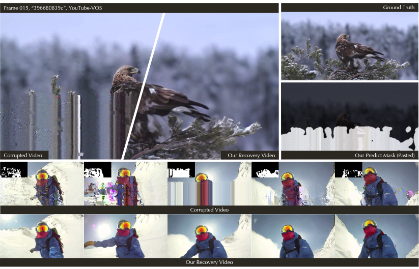

<div align="center">

<h1>[CVPR'25] Blind Bitstream-corrupted Video Recovery via Metadata-guided Diffusion Model</h1>

[Shuyun Wang](https://scholar.google.com/citations?user=8q0YhK4AAAAJ&hl=en)<sup>1,2</sup>, [Hu Zhang](https://scholar.google.com/citations?hl=en&user=M5NIoh0AAAAJ)<sup>2</sup>, [Xin Shen](https://scholar.google.com/citations?hl=en&user=LDQPQd4AAAAJ)<sup>1</sup>, [Dadong Wang](https://scholar.google.com/citations?hl=en&user=27Et5JcAAAAJ)<sup>2</sup>, and [Xin Yu](https://scholar.google.com/citations?hl=en&user=oxdtuSEAAAAJ)<sup>1*</sup>

<sup>1</sup>The University of Queensland &nbsp; <sup>2</sup>Data61, CSIRO

<p>
  <a href="https://openaccess.thecvf.com/content/CVPR2025/papers/Wang_Blind_Bitstream-corrupted_Video_Recovery_via_Metadata-guided_Diffusion_Model_CVPR_2025_paper.pdf">
    
  </a>
  <a href="https://github.com/Shuyun-Wang/M-GDM">
    
  </a>
  <a href="https://huggingface.co/Shuyun-Wang/M-GDM">
    
  </a>
</p>



</div>

---

## Method

Bitstream corruption (packet loss, bit errors) introduces structured artifacts that standard video restoration methods cannot handle blindly. MGDM leverages **metadata embedded in the compressed bitstream** — motion vectors (MVs) and frame type (I/B/P) — as conditioning signals to guide a diffusion model, enabling blind recovery without any prior knowledge of the corruption type.

**Two-stage pipeline:**

1. **Stage 1 — Metadata-guided Diffusion UNet**  
   Conditioned on the corrupted frame, per-pixel motion vectors, and frame-type embeddings. Produces a restored video and a predicted corruption mask.

2. **Stage 2 — Post-Refinement Module (PRM)**  
   Refines the diffusion output using stacked residual Swin Transformer blocks. The final result composites PRM's output inside the predicted mask with the original (uncorrupted) pixels outside.

---

## Getting Started

### 1. Clone the repository

```bash
git clone https://github.com/Shuyun-Wang/M-GDM.git
cd M-GDM
```

### 2. Set up the environment

```bash
uv venv --python 3.10
source .venv/bin/activate
uv pip install torch torchvision diffusers transformers accelerate einops lpips scikit-image imageio packaging timm opencv-python-headless
```

### 3. Download checkpoints

```bash
hf download Shuyun-Wang/M-GDM \
    --exclude "DAVIS.tar.gz" \
    --local-dir checkpoints
```

---

## Quick Test

Runs on corrupted frames only — no ground truth required. Outputs restored images and/or GIFs.

Expected data layout:

```
datasets/
├── BSC_JPEGImages/{video}/{00000..N}.jpg
├── BSC_mvs/{video}/{00000..N}.npz
├── frame_type.npy
└── <json>                               # {video_name: num_frames}
```

Run a quick test to verify your setup before the full evaluation:

```bash
python inference.py
```

---

## Evaluation

Runs on the DAVIS test set and computes PSNR / SSIM / LPIPS against ground truth.

Download and extract the DAVIS test set:

```bash
hf download Shuyun-Wang/M-GDM DAVIS.tar.gz --local-dir .
mkdir -p datasets
tar -xzf DAVIS.tar.gz -C datasets
```

This extracts to `datasets/DAVIS/`.

Expected data layout:

```
datasets/DAVIS/
├── BSC_JPEGImages/{video}/{00000..N}.jpg
├── GT_JPEGImages/{video}/{00000..N}.jpg
├── GT_masks/{video}/{00000..N}.png
├── BSC_mvs/{video}/{00000..N}.npz
├── frame_type.npy
├── quick_test.json
└── test_davis.json
```

Full evaluation on all 50 DAVIS videos:

```bash
python evaluate.py \
  --data_root  datasets/DAVIS \
  --json       test_davis.json \
  --ckpt_stage1 checkpoints/stage1 \
  --ckpt_prm    checkpoints/prm \
  --output_dir  results/evaluate
```

---

## Custom Dataset

To prepare your own bitstream-corrupted videos, use `prepare_data.py` to extract motion vectors and frame-type labels from raw H.264 files:

```bash
uv pip install motion-vector-extractor

python prepare_data.py --data_root /path/to/your/data --workers 8
```

The script expects `BSC_h264/*.h264` under `data_root` and writes:
- `BSC_mvs/{video}/{frame}.npz` — dense motion vector flow (H×W×4)
- `BSC_JPEGImages/{video}/{frame}.jpg` — decoded frames
- `frame_type.npy` — per-frame I/P/B labels

---

## Citation

```bibtex
@InProceedings{Wang_2025_CVPR,
    author    = {Wang, Shuyun and Zhang, Hu and Shen, Xin and Wang, Dadong and Yu, Xin},
    title     = {Blind Bitstream-corrupted Video Recovery via Metadata-guided Diffusion Model},
    booktitle = {Proceedings of the IEEE/CVF Conference on Computer Vision and Pattern Recognition (CVPR)},
    month     = {June},
    year      = {2025},
    pages     = {22975-22984}
}
```

---

## Acknowledgements

We sincerely thank the authors of the public codebases and datasets used in this work, including [E2FGVI](https://github.com/MCG-NKU/E2FGVI), [SwinIR](https://github.com/JingyunLiang/SwinIR), [LGVI](https://github.com/jianzongwu/Language-Driven-Video-Inpainting), and the [BSCV](https://github.com/LIUTIGHE/BSCV-Dataset) dataset.
